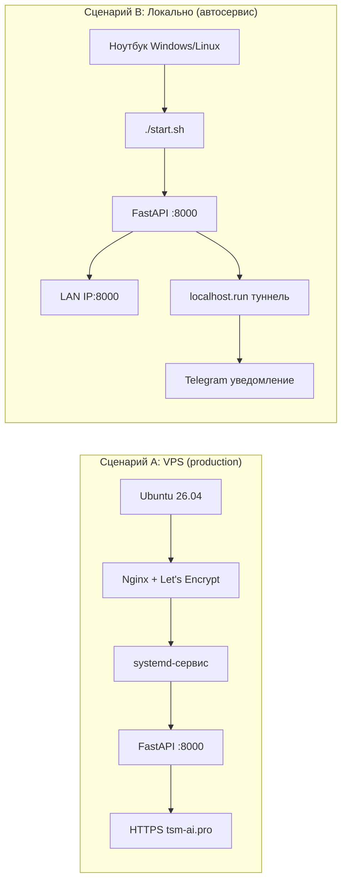

# TSM Auto v3.0

## 🚛 Производственная SPA-система управления автосервисом полного цикла

**© 2026 Олег Мордвинов | Версия: 3.0.9 | Обновлено: 12 августа 2026**

---

## 📌 Обзор системы

**TSM Auto v3.0** — полноценная производственная система для автосервиса грузовых автомобилей. Построена по современным стандартам: REST API на FastAPI, ORM через SQLModel, JWT-аутентификация с RBAC и SPA-фронтенд на Vanilla JS. Решает все задачи автосервиса — от приёма автомобиля до формирования заявок поставщикам и генерации Excel-документов с суммой прописью.

### Ключевые показатели

| Метрика | Значение |
|---------|----------|
| **36** | API эндпоинтов |
| **9** | SQLModel-таблиц |
| **4** | Роли пользователей |
| **7** | Мер безопасности |
| **2** | Сценария развёртывания |
| **1** | Профиль для быстрого старта |
| **1** | Production VPS (tsm-ai.pro) |

### ✅ Ключевые возможности

- 📝 Заказ-наряды с автоматическим расчётом зарплаты исполнителей
- 📦 Складской учёт запчастей с минимальными остатками и автосписанием
- 📤 Автоматические заявки поставщикам по работам «Замена ...»
- 📄 Генерация Excel с реквизитами ИП и суммой прописью
- 🛡️ Полное управление пользователями через админ-панель
- 🎭 Готовый профиль для быстрого развёртывания
- 📱 Мобильный UI с поддержкой iOS Safe Areas
- 🔐 Production-ready безопасность (сканеры, CORS, rate limiting, JWT)
- 📱 **Заявки водителей по QR-коду** — выбор госномера, запчастей, фото

---

## 🏗 Архитектура

### Общая схема

```
КЛИЕНТЫ
  📱 Мастер (телефон)
  💻 Менеджер (ПК)
  💼 Бухгалтер (ПК)
  🚛 Водитель (QR-наклейка)
    ↓
FRONTEND (SPA)
  index.html + login.html (Vanilla JS)
  driver.html (публичная форма для водителей)
    ↓
FASTAPI BACKEND (:8000)
  🛡️ Middleware: Сканеры → CORS → Rate Limit → JWT
    ↓
  10 API-РОУТЕРОВ
    auth • clients • orders • catalogs • requests
    reports • documents • admin • performers • public
    ↓
  БИЗНЕС-ЛОГИКА
    OrderService (заказ + ЗП + склад)
    DocumentService (Excel генерация)
    ↓
СЛОЙ ДАННЫХ
  SQLite (WAL + StaticPool)
  JSON конфиги
  Excel файлы
```

### Структура проекта

```
tsm_auto_prod/
├── backend/
│   ├── main.py                     # Точка входа FastAPI, middleware, роутеры
│   ├── db.py                       # SQLite + WAL + StaticPool + миграции
│   ├── auth.py                     # JWT + bcrypt + RBAC-декораторы
│   ├── rate_limit.py               # SlowAPI limiter
│   ├── config.py                   # Загрузка JSON-конфигов
│   │
│   ├── models/                     # SQLModel-модели (9 таблиц)
│   │   ├── user.py                 # Пользователи системы
│   │   ├── client.py               # Клиенты
│   │   ├── vehicle.py              # Автомобили клиентов
│   │   ├── catalog.py              # Work + Part (работы и запчасти)
│   │   ├── order.py                # Заказ-наряды (JSON-поля)
│   │   ├── document.py             # Сгенерированные документы
│   │   ├── performer.py            # Исполнители работ
│   │   └── driver_request.py       # Заявки водителей с QR ⭐ NEW
│   │
│   ├── routers/                    # 10 API-роутеров
│   │   ├── auth_router.py          # /api/auth/* (login, me)
│   │   ├── client_router.py        # /api/clients/* + /vehicles
│   │   ├── order_router.py         # /api/orders/* + status
│   │   ├── catalog_router.py       # /api/catalogs/works, /parts
│   │   ├── request_router.py       # /api/requests + /recipients + email
│   │   ├── report_router.py        # /api/reports/summary
│   │   ├── document_router.py      # /api/documents/*
│   │   ├── performer_router.py     # /api/performers/*
│   │   ├── admin_router.py         # /api/admin/settings + /users
│   │   └── public_router.py        # /api/public/* (водители) ⭐ NEW
│   │
│   └── services/                   # Бизнес-логика
│       ├── order_service.py        # Заказ + расчёт ЗП + склад
│       └── document_service.py     # Excel через openpyxl + num2words
│
├── frontend/
│   ├── index.html                  # SPA (Vanilla JS, ~200KB)
│   ├── login.html                  # Страница входа
│   └── driver.html                 # Форма для водителей ⭐ NEW
│
├── tools/                          # Миграция и сидирование
│   ├── import_profile.py           # Импорт профиля в БД
│   ├── export_profile.py           # Экспорт БД в JSON
│   ├── seed_data.py                # Начальные данные
│   ├── fix_vehicles.py             # Исправление vehicle_id
│   └── fix_performers.py           # Исправление performer_list
│
├── profiles/                       # Готовые профили
│   └── plastic/
│       └── profile.json            # Plastic Service (демо)
│
├── data/
│   ├── tsm_auto.db                 # SQLite (WAL-режим)
│   └── documents/                  # Сгенерированные Excel
│
├── config/                         # Редактируемые JSON-конфиги
│   ├── contractor.json             # Реквизиты ИП
│   ├── performers.json             # Ставки ЗП исполнителей
│   └── email.json                  # SMTP + получатели
│
├── start.sh                        # Локальный запуск + localhost.run
├── requirements.txt                # Python-зависимости
├── readme.md                       # Эта документация
└── .env                            # Секреты + настройки окружения
```

---

## ⭐ Полный список функций

### 📱 Заявки водителей (QR-наклейки) ⭐ NEW

- ✅ Публичная страница для водителей — `https://tsm-ai.pro/driver`
- ✅ Выбор госномера из базы (без авторизации)
- ✅ Выбор запчастей из каталога (чипсы: тап → +1, ❌ → сброс)
- ✅ Загрузка фото поломки (до 3 шт., до 5 МБ)
- ✅ Автоматическое письмо владельцу с полной информацией
- ✅ Сохранение заявок в БД (`driver_requests`)
- ✅ Статусы: `new` → `called` → `done`
- ✅ Защита от спама: 5 заявок/час с одного IP
- ✅ QR-код для визиток и наклеек на машины

---

### 📝 Заказ-наряды

- ✅ Создание заказа с выбором клиента и авто
- ✅ Ручной ввод клиента/авто с автосозданием в БД
- ✅ Переключение дат стрелками ← → и кнопка "Сегодня"
- ✅ Мультивыбор работ из каталога (тап = +1, крестик = сброс)
- ✅ Мультивыбор запчастей со склада с контролем остатков
- ✅ Назначение исполнителей по 3 группам (механика/ремонт/покраска)
- ✅ Автоматический расчёт зарплаты по ставкам из конфига
- ✅ Статусы: draft → in_progress → completed
- ✅ Поиск заказов по клиенту/госномеру/номеру
- ✅ Фильтр по месяцам с группировкой
- ✅ Удаление черновиков (все роли кроме accountant)
- ✅ Удаление завершённых (только admin)
- ✅ Кнопка «Назад» в просмотре заказа
- ✅ Скачивание Excel с реквизитами и суммой прописью

---

### 👥 Клиенты и авто

- ✅ CRUD клиентов (ФИО, ИНН, КПП, адрес, контакты)
- ✅ Контактные данные и заметки
- ✅ Несколько авто на одного клиента
- ✅ Добавление авто: plate, VIN, brand, model, year
- ✅ Удаление клиента с каскадом на авто (только admin)
- ✅ Поиск по имени, телефону, ИНН
- ✅ История заказов клиента
- ✅ Карточки клиентов с цветными аватарами (инициалы + градиент)

---

### 📦 Склад запчастей

- ✅ Каталог с артикулами и ед. измерения
- ✅ Остатки на складе (количество)
- ✅ Минимальные остатки (min_stock)
- ✅ Закупочная и розничная цена
- ✅ Привязка к работам (linked_work)
- ✅ Авто-списание при создании заказа
- ✅ Поиск по названию
- ✅ Активация/деактивация позиций

---

### 🛠️ Каталог работ

- ✅ 3 категории: mechanical/repair/painting
- ✅ Нормочасы и ставка руб/час
- ✅ Авто-расчёт стоимости работы
- ✅ Группировка по префиксам в UI (Осмотр, Замена, С/у и т.д.)
- ✅ Сворачиваемые подкатегории
- ✅ Активация/деактивация
- ✅ Специальная работа «Осмотр ТС» (выбирается по умолчанию)

---

### 📤 Заявки поставщикам

- ✅ Авто-сбор запчастей за выбранную дату
- ✅ Сопоставление «Замена X» → деталь из каталога
- ✅ Группировка по наименованиям
- ✅ Статистика: позиций, наименований, машин
- ✅ Режим ввода: select ↔ ручной (кнопка ✏️)
- ✅ Навигация по датам (← → Сегодня)
- ✅ Email-отправка через SMTP
- ✅ Множественный выбор получателей (Бухгалтерия/Поставщик/Склад)
- ✅ Предпросмотр заявки перед отправкой
- ✅ Копирование текста заявки в буфер обмена
- ✅ **Защита SMTP-пароля** — мастер получает только список получателей, без пароля

---

### 📄 Документы Excel

- ✅ Генерация через openpyxl
- ✅ Реквизиты ИП из contractor.json
- ✅ Номер заказ-наряда, даты
- ✅ Заказчик + автомобиль
- ✅ Таблица работ с суммами
- ✅ Таблица запчастей с суммами
- ✅ Итоговая сумма
- ✅ Сумма прописью (num2words)
- ✅ Блок подписей
- ✅ Скачивание через Blob (iOS PWA compatible)

---

### 📊 Отчёты и аналитика

- ✅ Сводка за выбранный месяц
- ✅ Количество заказов
- ✅ Общая выручка
- ✅ Средний чек
- ✅ Зарплата по каждому исполнителю
- ✅ Переключение месяцев (← →) и кнопка "Сейчас"
- ✅ Карточки статистики с иконками
- ✅ Детализация по исполнителям (клик → профиль)

---

### 🔧 Исполнители

- ✅ 3 группы: слесарные/ремонтные/покрасочные
- ✅ Индивидуальные ставки ЗП (в % от суммы работ группы)
- ✅ Активация/деактивация
- ✅ Назначение на заказ по группам
- ✅ Автоматический расчёт ЗП при создании заказа
- ✅ Профиль исполнителя с детальной статистикой

---

### 🛡️ Админ-панель (только admin)

- ✅ Редактирование реквизитов ИП
- ✅ Настройка SMTP (сервер, порт, логин)
- ✅ Управление получателями заявок (3 канала)
- ✅ **Управление пользователями:**
  - ✅ Создание новых пользователей (логин, пароль, ФИО, роль)
  - ✅ Редактирование роли и статуса (активен/неактивен)
  - ✅ Смена пароля с подтверждением
  - ✅ Деактивация пользователей (мягкое удаление)
  - ✅ Защита от деактивации себя и последнего админа
  - ✅ Красивые карточки с аватарами
  - ✅ Доступ: **только admin** (руководитель, мастер, бухгалтер не имеют доступа)

---

### 🎨 UI/UX

- ✅ 6 вкладок с iOS segmented control
- ✅ Анимированный ползунок табов
- ✅ **Unified Cards** — единый стиль шапок для всех вкладок (синий градиент)
- ✅ Нижняя context-панель действий с backdrop-blur
- ✅ Карточки с режимами ввода (select ↔ manual)
- ✅ Toast-уведомления (success/error/info)
- ✅ Адаптивность: 320px → 1440px
- ✅ iOS Safe Areas (env(safe-area-inset-bottom))
- ✅ FontAwesome 6 иконки
- ✅ 4 радиуса дизайна (pill/circle/sm/lg)
- ✅ Мобильные карточки для заказов (desktop → table, mobile → cards)
- ✅ **Приглушённая светлая палитра** (глаза не устают)
- ✅ **4 градиента аватаров** (вместо 7 кислотных)

---

## 🛡️ Безопасность (production-ready)

В v3.0.9 реализован комплексный подход к безопасности — **7 независимых слоёв защиты**.

### ✅ 1. Блокировка сканеров

Middleware возвращает 404 на типичные пути ботов: `/.env`, `/wp-admin`, `/actuator`, `/.git`, `/phpinfo` и др. (30+ паттернов). Логирует IP нарушителя.

**Пример из логов:**
```
INFO: 37.19.76.199:0 - "GET /wp-admin HTTP/1.0" 404 Not Found
INFO: 37.19.76.199:0 - "GET /.env HTTP/1.0" 404 Not Found
INFO: 37.19.76.199:0 - "GET /actuator/health HTTP/1.0" 404 Not Found
```

### ✅ 2. CORS whitelist

Вместо `["*"]` — строгий список разрешённых доменов из переменной `CORS_ORIGINS`. Защита от CSRF-атак и несанкционированного доступа с других сайтов.

**Конфигурация:**
```bash
CORS_ORIGINS=https://tsm-ai.pro,http://localhost:8000,http://127.0.0.1:8000
```

### ✅ 3. JWT + bcrypt

Токены с 24-часовым TTL, подписанные криптографическим HMAC-SHA256 ключом. Пароли хешируются через bcrypt с солью. Поддержка 4 ролей в токене.

**Пример токена:**
```json
{
  "user_id": 1,
  "role": "admin",
  "exp": 1717848000
}
```

### ✅ 4. Rate limiting (SlowAPI)

Эндпоинты `/api/auth/login` и `/api/public/request` ограничены **5 попытками в минуту** с одного IP. Защита от брутфорса и спама.

**Пример из логов:**
```
INFO: 37.19.76.199:0 - "POST /api/auth/login HTTP/1.0" 401 Unauthorized
INFO: 37.19.76.199:0 - "POST /api/auth/login HTTP/1.0" 429 Too Many Requests
```

### ✅ 5. Проверка JWT_SECRET

При старте приложение проверяет наличие и стойкость `SECRET_KEY`. В production-режиме запуск с дефолтным ключом невозможен — приложение падает с ошибкой.

### ✅ 6. WAL-режим SQLite

Write-Ahead Logging для параллельного чтения/записи без блокировок. Плюс `PRAGMA synchronous=NORMAL` и кеш 64MB.

### ✅ 7. Health endpoint

`GET /api/health` для мониторинга через systemd, UptimeRobot или другие системы. Публичный, без авторизации.

---

### Конфигурация безопасности в `.env`

```bash
# === КРИТИЧНЫЕ СЕКРЕТЫ ===
SECRET_KEY=
ADMIN_DEFAULT_PASSWORD=    # сменить после первого входа!

# === ОКРУЖЕНИЕ ===
ENV=development                       # или production на VPS

# === CORS (список через запятую) ===
CORS_ORIGINS=https://tsm-ai.pro,http://localhost:8000,http://127.0.0.1:8000,http://192.168.1.165:8000

# === БД ===
DATABASE_URL=sqlite:///data/tsm_auto.db
```

---

## 🗄 Схема базы данных

### ER-диаграмма

```
USERS
  id (PK)
  login (UK)
  password
  full_name
  role (admin/manager/master/accountant)
  is_active
    ↓ master_id
ORDERS
  id (PK)
  order_id
  zn_number
  vehicle_id ──→ VEHICLES
  client_id ──→ CLIENTS
  master_id ──→ USERS
  status
  date
  work_items (JSON)
  material_items (JSON)
  performers (JSON)
  salary (JSON)
  total_amount
    ↓ client_id
CLIENTS
  id (PK)
  full_name
  short_name
  inn
  kpp
  address
  phone
  email
  contact_person
  notes
    ↓ client_id
VEHICLES
  id (PK)
  client_id (FK)
  plate
  vin
  brand
  model
  year
    ↓ order_id
DOCUMENTS
  id (PK)
  order_id (FK)
  doc_type
  filename
  file_path
  generated_at
```

### Таблицы каталогов

```
WORKS
  id (PK)
  name
  category (mechanical/repair/painting)
  norm_hours
  rate_rub
  is_active

PARTS
  id (PK)
  name
  article
  unit
  quantity
  min_stock
  purchase_price
  retail_price
  linked_work
  is_active

PERFORMERS
  id (PK)
  full_name
  group (mechanical/repair/painting)
  is_active
```

### Таблица заявок водителей ⭐ NEW

```
DRIVER_REQUESTS
  id (PK)
  plate (INDEX)        # госномер
  phone                # телефон водителя
  description          # описание поломки
  desired_date         # дата приезда
  parts (JSON)         # {"название": количество}
  status               # new | called | done
  created_at
```

---

## ⚙️ API Reference (36 эндпоинтов)

### 🔐 Аутентификация

| Метод | Эндпоинт | Описание | Доступ |
|-------|----------|----------|--------|
| POST | `/api/auth/login` | Вход в систему | 🚦 5/min |
| GET | `/api/auth/me` | Текущий пользователь | JWT |

### 👥 Клиенты и авто

| Метод | Эндпоинт | Описание | Доступ |
|-------|----------|----------|--------|
| GET | `/api/clients` | Список клиентов | Все |
| POST | `/api/clients` | Создать клиента | master+ |
| GET | `/api/clients/{id}` | Детали клиента | Все |
| PUT | `/api/clients/{id}` | Обновить клиента | master+ |
| DELETE | `/api/clients/{id}` | Удалить клиента | admin |
| POST | `/api/clients/{id}/vehicles` | Добавить авто | master+ |
| DELETE | `/api/clients/{cid}/vehicles/{vid}` | Удалить авто | admin |

### 📋 Заказы

| Метод | Эндпоинт | Описание | Доступ |
|-------|----------|----------|--------|
| GET | `/api/orders` | Список заказов | Все |
| POST | `/api/orders` | Создать заказ | master+ |
| GET | `/api/orders/{id}` | Детали заказа | Все |
| PUT | `/api/orders/{id}/status` | Сменить статус | master+ |
| DELETE | `/api/orders/{id}` | Удалить заказ | draft: все, completed: admin |

### 🛠️ Каталоги

| Метод | Эндпоинт | Описание | Доступ |
|-------|----------|----------|--------|
| GET | `/api/catalogs/works` | Список работ | Все |
| POST | `/api/catalogs/works` | Создать работу | manager+ |
| DELETE | `/api/catalogs/works/{id}` | Удалить работу | manager+ |
| GET | `/api/catalogs/parts` | Список запчастей | Все |
| POST | `/api/catalogs/parts` | Создать запчасть | manager+ |
| DELETE | `/api/catalogs/parts/{id}` | Удалить запчасть | manager+ |

### 🔧 Исполнители

| Метод | Эндпоинт | Описание | Доступ |
|-------|----------|----------|--------|
| GET | `/api/performers` | Список исполнителей | Все |
| POST | `/api/performers` | Создать исполнителя | manager+ |
| DELETE | `/api/performers/{id}` | Удалить исполнителя | manager+ |

### 📦 Заявки на запчасти

| Метод | Эндпоинт | Описание | Доступ |
|-------|----------|----------|--------|
| GET | `/api/requests?date=ДД.ММ.ГГГГ` | Заявки за дату | master+ |
| GET | `/api/requests/recipients` | Получатели (без SMTP-пароля) | master+ |
| POST | `/api/requests/send-email` | Отправить на email | master+ |

### 📱 Публичные эндпоинты для водителей ⭐ NEW

| Метод | Эндпоинт | Описание | Доступ |
|-------|----------|----------|--------|
| GET | `/api/public/vehicles` | Список госномеров | Public |
| GET | `/api/public/parts` | Список запчастей | Public |
| POST | `/api/public/request` | Отправить заявку с фото | 🚦 5/hour |

### 📊 Отчёты

| Метод | Эндпоинт | Описание | Доступ |
|-------|----------|----------|--------|
| GET | `/api/reports/summary?month=&year=` | Сводка за месяц | Все |

### 📄 Документы

| Метод | Эндпоинт | Описание | Доступ |
|-------|----------|----------|--------|
| POST | `/api/documents/order/{id}` | Генерация Excel | Все |
| GET | `/api/documents/download/{file}` | Скачивание файла | Все |

### ⚙️ Админка (только admin)

| Метод | Эндпоинт | Описание | Доступ |
|-------|----------|----------|--------|
| GET | `/api/admin/settings` | Получить настройки | admin |
| PUT | `/api/admin/settings` | Сохранить настройки | admin |
| GET | `/api/admin/users` | Список пользователей | admin |
| POST | `/api/admin/users` | Создать пользователя | admin |
| PUT | `/api/admin/users/{id}` | Обновить пользователя | admin |
| PUT | `/api/admin/users/{id}/password` | Сменить пароль | admin |
| DELETE | `/api/admin/users/{id}` | Деактивировать пользователя | admin |

### 🏥 Мониторинг

| Метод | Эндпоинт | Описание | Доступ |
|-------|----------|----------|--------|
| GET | `/api/health` | Проверка здоровья | Public |

> ⚠️ Все эндпоинты (кроме `/api/auth/login`, `/api/health`, `/`, `/login`, `/api/public/*`, `/driver`) требуют заголовок `Authorization: Bearer <JWT>`.

---

## 🚀 Два сценария развёртывания

### Сценарий A: VPS (24/7, HTTPS)

| Компонент | Конфигурация |
|-----------|--------------|
| **ОС** | Ubuntu 26.04 LTS |
| **Python** | 3.12 (pyenv) |
| **Веб-сервер** | Nginx 1.28+ (reverse proxy) |
| **SSL** | Let's Encrypt + авто-продление |
| **Менеджер процессов** | systemd (Restart=always) |
| **Домен** | https://tsm-ai.pro |

**systemd unit:** `/etc/systemd/system/tsm-auto.service`

```ini
[Unit]
Description=TSM Auto v3.0
After=network.target

[Service]
Type=simple
User=tsm
WorkingDirectory=/home/tsm/tsm_auto_prod
EnvironmentFile=/home/tsm/tsm_auto_prod/.env
ExecStart=/home/tsm/tsm_auto_prod/venv/bin/uvicorn backend.main:app \
    --host 127.0.0.1 \
    --port 8000 \
    --proxy-headers \
    --forwarded-allow-ips="127.0.0.1"
Restart=always
RestartSec=10

[Install]
WantedBy=multi-user.target
```

> ⚠️ **Важно:** Флаги `--proxy-headers` и `--forwarded-allow-ips` нужны, чтобы uvicorn видел реальные IP клиентов из заголовка `X-Forwarded-For`, а не `127.0.0.1`. Без них rate limiting будет блокировать всех пользователей разом.

### Сценарий B: Локально в автосервисе

Установка на ноутбук в автосервисе. Сотрудники работают в локальной сети.

---

## 📝 Changelog

### v3.0.9 (12 августа 2026) — 📱 QR-заявки для водителей

- ✅ **Новый модуль: заявки водителей по QR-коду**
  - Публичная страница `/driver` с формой для водителей
  - Выбор госномера из БД (эндпоинт `/api/public/vehicles`)
  - Выбор запчастей из каталога (чипсы с инкрементом и ❌)
  - Загрузка фото поломки (до 3 шт., до 5 МБ)
  - Автоматическое письмо на почту с текстом и вложениями
  - Сохранение в БД (`driver_requests` с полем `parts`)
  - Автоматическая миграция БД (добавление колонки `parts`)
- ✅ **Новая таблица:** `driver_requests` (заявки водителей)
- ✅ **Новый роутер:** `public_router.py` (публичные эндпоинты)
- ✅ **Новые эндпоинты:** `/api/public/vehicles`, `/api/public/parts`, `/api/public/request`
- ✅ **Защита от спама:** 5 заявок/час с одного IP (через SlowAPI)
- ✅ **Обновлён `db.py`:** автоматическое добавление новых колонок при старте

### v3.0.8 (7 июня 2026)

#### 🛡️ Production-hardening на VPS (tsm-ai.pro)
- ✅ Защита скачивания Excel через JWT
- ✅ Rate limiting по реальному IP
- ✅ Nginx + systemd с флагами `--proxy-headers`
- ✅ Расширение блокировки сканеров
- ✅ Фиксы стабильности

### v3.0.7 (29-30 мая 2026)

#### 🎭 Демо-профиль для быстрого старта
- ✅ `data/demo_profile.json` — реалистичный профиль автосервиса
- ✅ `tools/import_demo.py` — скрипт импорта
- ✅ **UI/UX:** Unified Cards, приглушённая палитра, 4 градиента аватаров
- ✅ **Разделение прав:** только admin имеет доступ к админке

---

**TSM Auto v3.0.9** | Обновлено: 12 августа 2026
© 2026 Олег Мордвинов | Production-ready SPA-система для автосервиса

**FastAPI + SQLModel + JWT + RBAC + Demo Profile + Unified Cards + Production Security + QR-заявки**

# TSM Auto v3.0

## 🚛 Производственная SPA-система управления автосервисом полного цикла

**© 2026 Олег Мордвинов | Версия: 3.0.8 | Обновлено: 7 июня 2026**

---

## 📌 Обзор системы

**TSM Auto v3.0** — полноценная производственная система для автосервиса грузовых автомобилей. Построена по современным стандартам: REST API на FastAPI, ORM через SQLModel, JWT-аутентификация с RBAC и SPA-фронтенд на Vanilla JS. Решает все задачи автосервиса — от приёма автомобиля до формирования заявок поставщикам и генерации Excel-документов с суммой прописью.

### Ключевые показатели

| Метрика | Значение |
|---------|----------|
| **33** | API эндпоинтов |
| **8** | SQLModel-таблиц |
| **4** | Роли пользователей |
| **7** | Мер безопасности |
| **2** | Сценария развёртывания |
| **1** | Профиль для быстрого старта |
| **1** | Production VPS (tsm-ai.pro) |

### ✅ Ключевые возможности

- 📝 Заказ-наряды с автоматическим расчётом зарплаты исполнителей
- 📦 Складской учёт запчастей с минимальными остатками и автосписанием
- 📤 Автоматические заявки поставщикам по работам «Замена ...»
- 📄 Генерация Excel с реквизитами ИП и суммой прописью
- 🛡️ Полное управление пользователями через админ-панель
- 🎭 Готовый профиль для быстрого развёртывания
- 📱 Мобильный UI с поддержкой iOS Safe Areas
- 🔐 Production-ready безопасность (сканеры, CORS, rate limiting, JWT)

---

## 🏗 Архитектура

### Общая схема

```
КЛИЕНТЫ
  📱 Мастер (телефон)
  💻 Менеджер (ПК)
  💼 Бухгалтер (ПК)
    ↓
FRONTEND (SPA)
  index.html + login.html (Vanilla JS)
    ↓
FASTAPI BACKEND (:8000)
  🛡️ Middleware: Сканеры → CORS → Rate Limit → JWT
    ↓
  9 API-РОУТЕРОВ
    auth • clients • orders • catalogs • requests
    reports • documents • admin • performers
    ↓
  БИЗНЕС-ЛОГИКА
    OrderService (заказ + ЗП + склад)
    DocumentService (Excel генерация)
    ↓
СЛОЙ ДАННЫХ
  SQLite (WAL + StaticPool)
  JSON конфиги
  Excel файлы
```

### Структура проекта

```
tsm_auto_prod/
├── backend/
│   ├── main.py                     # Точка входа FastAPI, middleware, роутеры
│   ├── db.py                       # SQLite + WAL + StaticPool
│   ├── auth.py                     # JWT + bcrypt + RBAC-декораторы
│   ├── rate_limit.py               # SlowAPI limiter
│   ├── config.py                   # Загрузка JSON-конфигов
│   │
│   ├── models/                     # SQLModel-модели (8 таблиц)
│   │   ├── user.py                 # Пользователи системы
│   │   ├── client.py               # Клиенты
│   │   ├── vehicle.py              # Автомобили клиентов
│   │   ├── catalog.py              # Work + Part (работы и запчасти)
│   │   ├── order.py                # Заказ-наряды (JSON-поля)
│   │   ├── document.py             # Сгенерированные документы
│   │   └── performer.py            # Исполнители работ
│   │
│   ├── routers/                    # 9 API-роутеров
│   │   ├── auth_router.py          # /api/auth/* (login, me)
│   │   ├── client_router.py        # /api/clients/* + /vehicles
│   │   ├── order_router.py         # /api/orders/* + status
│   │   ├── catalog_router.py       # /api/catalogs/works, /parts
│   │   ├── request_router.py       # /api/requests + /recipients + email
│   │   ├── report_router.py        # /api/reports/summary
│   │   ├── document_router.py      # /api/documents/*
│   │   ├── performer_router.py     # /api/performers/*
│   │   └── admin_router.py         # /api/admin/settings + /users
│   │
│   └── services/                   # Бизнес-логика
│       ├── order_service.py        # Заказ + расчёт ЗП + склад
│       └── document_service.py     # Excel через openpyxl + num2words
│
├── frontend/
│   ├── index.html                  # SPA (Vanilla JS, ~200KB)
│   └── login.html                  # Страница входа
│
├── tools/                          # Миграция и сидирование
│   ├── import_profile.py           # Импорт профиля в БД
│   ├── export_profile.py           # Экспорт БД в JSON
│   ├── seed_data.py                # Начальные данные
│   ├── fix_vehicles.py             # Исправление vehicle_id
│   └── fix_performers.py           # Исправление performer_list
│
├── profiles/                       # Готовые профили
│   └── plastic/
│       └── profile.json            # Plastic Service (демо)
│
├── data/
│   ├── tsm_auto.db                 # SQLite (WAL-режим)
│   └── documents/                  # Сгенерированные Excel
│
├── config/                         # Редактируемые JSON-конфиги
│   ├── contractor.json             # Реквизиты ИП
│   ├── performers.json             # Ставки ЗП исполнителей
│   └── email.json                  # SMTP + получатели
│
├── start.sh                        # Локальный запуск + localhost.run
├── requirements.txt                # Python-зависимости
├── readme.md                       # Эта документация
└── .env                            # Секреты + настройки окружения
```

---

## ⭐ Полный список функций

### 📝 Заказ-наряды

- ✅ Создание заказа с выбором клиента и авто
- ✅ Ручной ввод клиента/авто с автосозданием в БД
- ✅ Переключение дат стрелками ← → и кнопка "Сегодня"
- ✅ Мультивыбор работ из каталога (тап = +1, крестик = сброс)
- ✅ Мультивыбор запчастей со склада с контролем остатков
- ✅ Назначение исполнителей по 3 группам (механика/ремонт/покраска)
- ✅ Автоматический расчёт зарплаты по ставкам из конфига
- ✅ Статусы: draft → in_progress → completed
- ✅ Поиск заказов по клиенту/госномеру/номеру
- ✅ Фильтр по месяцам с группировкой
- ✅ Удаление черновиков (все роли кроме accountant)
- ✅ Удаление завершённых (только admin)
- ✅ Кнопка «Назад» в просмотре заказа
- ✅ Скачивание Excel с реквизитами и суммой прописью

### 👥 Клиенты и авто

- ✅ CRUD клиентов (ФИО, ИНН, КПП, адрес, контакты)
- ✅ Контактные данные и заметки
- ✅ Несколько авто на одного клиента
- ✅ Добавление авто: plate, VIN, brand, model, year
- ✅ Удаление клиента с каскадом на авто (только admin)
- ✅ Поиск по имени, телефону, ИНН
- ✅ История заказов клиента
- ✅ Карточки клиентов с цветными аватарами (инициалы + градиент)

### 📦 Склад запчастей

- ✅ Каталог с артикулами и ед. измерения
- ✅ Остатки на складе (количество)
- ✅ Минимальные остатки (min_stock)
- ✅ Закупочная и розничная цена
- ✅ Привязка к работам (linked_work)
- ✅ Авто-списание при создании заказа
- ✅ Поиск по названию
- ✅ Активация/деактивация позиций

### 🛠️ Каталог работ

- ✅ 3 категории: mechanical/repair/painting
- ✅ Нормочасы и ставка руб/час
- ✅ Авто-расчёт стоимости работы
- ✅ Группировка по префиксам в UI (Осмотр, Замена, С/у и т.д.)
- ✅ Сворачиваемые подкатегории
- ✅ Активация/деактивация
- ✅ Специальная работа «Осмотр ТС» (выбирается по умолчанию)

### 📤 Заявки поставщикам

- ✅ Авто-сбор запчастей за выбранную дату
- ✅ Сопоставление «Замена X» → деталь из каталога
- ✅ Группировка по наименованиям
- ✅ Статистика: позиций, наименований, машин
- ✅ Режим ввода: select ↔ ручной (кнопка ✏️)
- ✅ Навигация по датам (← → Сегодня)
- ✅ Email-отправка через SMTP
- ✅ Множественный выбор получателей (Бухгалтерия/Поставщик/Склад)
- ✅ Предпросмотр заявки перед отправкой
- ✅ Копирование текста заявки в буфер обмена
- ✅ **Защита SMTP-пароля** — мастер получает только список получателей, без пароля

### 📄 Документы Excel

- ✅ Генерация через openpyxl
- ✅ Реквизиты ИП из contractor.json
- ✅ Номер заказ-наряда, даты
- ✅ Заказчик + автомобиль
- ✅ Таблица работ с суммами
- ✅ Таблица запчастей с суммами
- ✅ Итоговая сумма
- ✅ Сумма прописью (num2words)
- ✅ Блок подписей
- ✅ Скачивание через Blob (iOS PWA compatible)

### 📊 Отчёты и аналитика

- ✅ Сводка за выбранный месяц
- ✅ Количество заказов
- ✅ Общая выручка
- ✅ Средний чек
- ✅ Зарплата по каждому исполнителю
- ✅ Переключение месяцев (← →) и кнопка "Сейчас"
- ✅ Карточки статистики с иконками
- ✅ Детализация по исполнителям (клик → профиль)

### 🔧 Исполнители

- ✅ 3 группы: слесарные/ремонтные/покрасочные
- ✅ Индивидуальные ставки ЗП (в % от суммы работ группы)
- ✅ Активация/деактивация
- ✅ Назначение на заказ по группам
- ✅ Автоматический расчёт ЗП при создании заказа
- ✅ Профиль исполнителя с детальной статистикой

### 🛡️ Админ-панель (только admin)

- ✅ Редактирование реквизитов ИП
- ✅ Настройка SMTP (сервер, порт, логин)
- ✅ Управление получателями заявок (3 канала)
- ✅ **Управление пользователями:**
  - ✅ Создание новых пользователей (логин, пароль, ФИО, роль)
  - ✅ Редактирование роли и статуса (активен/неактивен)
  - ✅ Смена пароля с подтверждением
  - ✅ Деактивация пользователей (мягкое удаление)
  - ✅ Защита от деактивации себя и последнего админа
  - ✅ Красивые карточки с аватарами
  - ✅ Доступ: **только admin** (руководитель, мастер, бухгалтер не имеют доступа)

### 🎨 UI/UX

- ✅ 6 вкладок с iOS segmented control
- ✅ Анимированный ползунок табов
- ✅ **Unified Cards** — единый стиль шапок для всех вкладок (синий градиент)
- ✅ Нижняя context-панель действий с backdrop-blur
- ✅ Карточки с режимами ввода (select ↔ manual)
- ✅ Toast-уведомления (success/error/info)
- ✅ Адаптивность: 320px → 1440px
- ✅ iOS Safe Areas (env(safe-area-inset-bottom))
- ✅ FontAwesome 6 иконки
- ✅ 4 радиуса дизайна (pill/circle/sm/lg)
- ✅ Мобильные карточки для заказов (desktop → table, mobile → cards)
- ✅ **Приглушённая светлая палитра** (глаза не устают)
- ✅ **4 градиента аватаров** (вместо 7 кислотных)

---

## 🛡️ Безопасность (production-ready)

В v3.0.8 реализован комплексный подход к безопасности — **7 независимых слоёв защиты**.

### ✅ 1. Блокировка сканеров

Middleware возвращает 404 на типичные пути ботов: `/.env`, `/wp-admin`, `/actuator`, `/.git`, `/phpinfo` и др. (30+ паттернов). Логирует IP нарушителя.

**Пример из логов:**
```
INFO: 37.19.76.199:0 - "GET /wp-admin HTTP/1.0" 404 Not Found
INFO: 37.19.76.199:0 - "GET /.env HTTP/1.0" 404 Not Found
INFO: 37.19.76.199:0 - "GET /actuator/health HTTP/1.0" 404 Not Found
```

### ✅ 2. CORS whitelist

Вместо `["*"]` — строгий список разрешённых доменов из переменной `CORS_ORIGINS`. Защита от CSRF-атак и несанкционированного доступа с других сайтов.

**Конфигурация:**
```bash
CORS_ORIGINS=https://tsm-ai.pro,http://localhost:8000,http://127.0.0.1:8000
```

### ✅ 3. JWT + bcrypt

Токены с 24-часовым TTL, подписанные криптографическим HMAC-SHA256 ключом. Пароли хешируются через bcrypt с солью. Поддержка 4 ролей в токене.

**Пример токена:**
```json
{
  "user_id": 1,
  "role": "admin",
  "exp": 1717848000
}
```

### ✅ 4. Rate limiting (SlowAPI)

Эндпоинт `/api/auth/login` ограничен **5 попытками в минуту** с одного IP. Защита от брутфорса паролей.

**Пример из логов:**
```
INFO: 37.19.76.199:0 - "POST /api/auth/login HTTP/1.0" 401 Unauthorized
INFO: 37.19.76.199:0 - "POST /api/auth/login HTTP/1.0" 401 Unauthorized
INFO: 37.19.76.199:0 - "POST /api/auth/login HTTP/1.0" 401 Unauthorized
INFO: 37.19.76.199:0 - "POST /api/auth/login HTTP/1.0" 401 Unauthorized
INFO: 37.19.76.199:0 - "POST /api/auth/login HTTP/1.0" 401 Unauthorized
INFO: 37.19.76.199:0 - "POST /api/auth/login HTTP/1.0" 429 Too Many Requests
```

### ✅ 5. Проверка JWT_SECRET

При старте приложение проверяет наличие и стойкость `SECRET_KEY`. В production-режиме запуск с дефолтным ключом невозможен — приложение падает с ошибкой.

**Проверка:**
```python
if SECRET_KEY in ("change-me-in-production", "tsm-auto-super-secret-key-2026-change-me"):
    if ENV_MODE == "production":
        print("❌ КРИТИЧНО: Используется дефолтный SECRET_KEY в production!")
        sys.exit(1)
```

### ✅ 6. WAL-режим SQLite

Write-Ahead Logging для параллельного чтения/записи без блокировок. Плюс `PRAGMA synchronous=NORMAL` и кеш 64MB.

**Конфигурация:**
```python
engine = create_engine(
    DATABASE_URL,
    echo=False,
    connect_args={"check_same_thread": False},
    poolclass=StaticPool,
)

with engine.connect() as conn:
    conn.execute(text("PRAGMA journal_mode=WAL;"))
    conn.execute(text("PRAGMA synchronous=NORMAL;"))
    conn.execute(text("PRAGMA cache_size=-64000;"))  # 64MB
    conn.commit()
```

### ✅ 7. Health endpoint

`GET /api/health` для мониторинга через systemd, UptimeRobot или другие системы. Публичный, без авторизации.

**Ответ:**
```json
{
  "status": "ok",
  "version": "3.0.8",
  "service": "TSM Auto"
}
```

### Поток запроса через middleware

```
Клиент
  ↓
🛡️ BlockScanners (проверка 30+ паттернов)
  ↓ (если не сканер)
🔒 CORS (проверка Origin)
  ↓ (если разрешён)
🚦 RateLimit (проверка лимитов)
  ↓ (если не превышен)
🔐 JWT-Auth (проверка токена)
  ↓ (если валиден)
Роутер (бизнес-логика)
  ↓
SQLite (WAL)
```

### Конфигурация безопасности в `.env`

```bash
# === КРИТИЧНЫЕ СЕКРЕТЫ ===
SECRET_KEY=
ADMIN_DEFAULT_PASSWORD=    # сменить после первого входа!

# === ОКРУЖЕНИЕ ===
ENV=development                       # или production на VPS

# === CORS (список через запятую) ===
CORS_ORIGINS=https://tsm-ai.pro,http://localhost:8000,http://127.0.0.1:8000,http://192.168.1.165:8000

# === БД ===
DATABASE_URL=sqlite:///data/tsm_auto.db
```

---

## 🗄 Схема базы данных

### ER-диаграмма

```
USERS
  id (PK)
  login (UK)
  password
  full_name
  role (admin/manager/master/accountant)
  is_active
    ↓ master_id
ORDERS
  id (PK)
  order_id
  zn_number
  vehicle_id ──→ VEHICLES
  client_id ──→ CLIENTS
  master_id ──→ USERS
  status
  date
  work_items (JSON)
  material_items (JSON)
  performers (JSON)
  salary (JSON)
  total_amount
    ↓ client_id
CLIENTS
  id (PK)
  full_name
  short_name
  inn
  kpp
  address
  phone
  email
  contact_person
  notes
    ↓ client_id
VEHICLES
  id (PK)
  client_id (FK)
  plate
  vin
  brand
  model
  year
    ↓ order_id
DOCUMENTS
  id (PK)
  order_id (FK)
  doc_type
  filename
  file_path
  generated_at
```

### Таблицы каталогов

```
WORKS
  id (PK)
  name
  category (mechanical/repair/painting)
  norm_hours
  rate_rub
  is_active

PARTS
  id (PK)
  name
  article
  unit
  quantity
  min_stock
  purchase_price
  retail_price
  linked_work
  is_active

PERFORMERS
  id (PK)
  full_name
  group (mechanical/repair/painting)
  is_active
```

### JSON-поля в таблице orders

Для гибкости бизнес-логики часть данных хранится в JSON-формате (поддерживается SQLite):

**work_items**
```json
[
  {
    "work_id": 5,
    "name": "Замена тормозных колодок передних",
    "norm_hours": 1.5,
    "rate_rub": 800,
    "quantity": 2,
    "sum_rub": 2400
  }
]
```

**material_items**
```json
[
  {
    "part_id": 12,
    "name": "Колодки тормозные передние",
    "article": "BP-1234",
    "quantity": 2,
    "unit": "компл",
    "price": 3500,
    "sum_rub": 7000
  }
]
```

**salary_dict**
```json
{
  "Иванов И.И.": 2400,
  "Петров П.П.": 1800
}
```

---

## ⚙️ API Reference (33 эндпоинта)

### 🔐 Аутентификация

| Метод | Эндпоинт | Описание | Доступ |
|-------|----------|----------|--------|
| POST | `/api/auth/login` | Вход в систему | 🚦 5/min |
| GET | `/api/auth/me` | Текущий пользователь | JWT |

### 👥 Клиенты и авто

| Метод | Эндпоинт | Описание | Доступ |
|-------|----------|----------|--------|
| GET | `/api/clients` | Список клиентов | Все |
| POST | `/api/clients` | Создать клиента | master+ |
| GET | `/api/clients/{id}` | Детали клиента | Все |
| PUT | `/api/clients/{id}` | Обновить клиента | master+ |
| DELETE | `/api/clients/{id}` | Удалить клиента | admin |
| POST | `/api/clients/{id}/vehicles` | Добавить авто | master+ |
| DELETE | `/api/clients/{cid}/vehicles/{vid}` | Удалить авто | admin |

### 📋 Заказы

| Метод | Эндпоинт | Описание | Доступ |
|-------|----------|----------|--------|
| GET | `/api/orders` | Список заказов | Все |
| POST | `/api/orders` | Создать заказ | master+ |
| GET | `/api/orders/{id}` | Детали заказа | Все |
| PUT | `/api/orders/{id}/status` | Сменить статус | master+ |
| DELETE | `/api/orders/{id}` | Удалить заказ | draft: все, completed: admin |

### 🛠️ Каталоги

| Метод | Эндпоинт | Описание | Доступ |
|-------|----------|----------|--------|
| GET | `/api/catalogs/works` | Список работ | Все |
| POST | `/api/catalogs/works` | Создать работу | manager+ |
| DELETE | `/api/catalogs/works/{id}` | Удалить работу | manager+ |
| GET | `/api/catalogs/parts` | Список запчастей | Все |
| POST | `/api/catalogs/parts` | Создать запчасть | manager+ |
| DELETE | `/api/catalogs/parts/{id}` | Удалить запчасть | manager+ |

### 🔧 Исполнители

| Метод | Эндпоинт | Описание | Доступ |
|-------|----------|----------|--------|
| GET | `/api/performers` | Список исполнителей | Все |
| POST | `/api/performers` | Создать исполнителя | manager+ |
| DELETE | `/api/performers/{id}` | Удалить исполнителя | manager+ |

### 📦 Заявки на запчасти

| Метод | Эндпоинт | Описание | Доступ |
|-------|----------|----------|--------|
| GET | `/api/requests?date=ДД.ММ.ГГГГ` | Заявки за дату | master+ |
| **GET** | **`/api/requests/recipients`** | **Получатели (без SMTP-пароля)** ⭐ | **master+** |
| POST | `/api/requests/send-email` | Отправить на email | master+ |

### 📊 Отчёты

| Метод | Эндпоинт | Описание | Доступ |
|-------|----------|----------|--------|
| GET | `/api/reports/summary?month=&year=` | Сводка за месяц | Все |

### 📄 Документы

| Метод | Эндпоинт | Описание | Доступ |
|-------|----------|----------|--------|
| POST | `/api/documents/order/{id}` | Генерация Excel | Все |
| GET | `/api/documents/download/{file}` | Скачивание файла | Все |

### ⚙️ Админка (только admin)

| Метод | Эндпоинт | Описание | Доступ |
|-------|----------|----------|--------|
| GET | `/api/admin/settings` | Получить настройки | admin |
| PUT | `/api/admin/settings` | Сохранить настройки | admin |
| GET | `/api/admin/users` | Список пользователей | admin |
| POST | `/api/admin/users` | Создать пользователя | admin |
| PUT | `/api/admin/users/{id}` | Обновить пользователя | admin |
| PUT | `/api/admin/users/{id}/password` | Сменить пароль | admin |
| DELETE | `/api/admin/users/{id}` | Деактивировать пользователя | admin |

### 🏥 Мониторинг

| Метод | Эндпоинт | Описание | Доступ |
|-------|----------|----------|--------|
| GET | `/api/health` | Проверка здоровья | Public |

> ⚠️ Все эндпоинты (кроме `/api/auth/login`, `/api/health`, `/`, `/login`) требуют заголовок `Authorization: Bearer <JWT>`.

---

## 🚀 Два сценария развёртывания



### Сценарий A: VPS (24/7, HTTPS)

| Компонент | Конфигурация |
|-----------|--------------|
| **ОС** | Ubuntu 26.04 LTS |
| **Python** | 3.12 (pyenv) |
| **Веб-сервер** | Nginx 1.28+ (reverse proxy) |
| **SSL** | Let's Encrypt + авто-продление |
| **Менеджер процессов** | systemd (Restart=always) |
| **Домен** | https://tsm-ai.pro |

**systemd unit:** `/etc/systemd/system/tsm-auto.service`

```ini
[Unit]
Description=TSM Auto v3.0
After=network.target

[Service]
Type=simple
User=tsm
WorkingDirectory=/home/tsm/tsm_auto_prod
EnvironmentFile=/home/tsm/tsm_auto_prod/.env
ExecStart=/home/tsm/tsm_auto_prod/venv/bin/uvicorn backend.main:app \
    --host 127.0.0.1 \
    --port 8000 \
    --proxy-headers \
    --forwarded-allow-ips="127.0.0.1"
Restart=always
RestartSec=10

[Install]
WantedBy=multi-user.target
```

> ⚠️ **Важно:** Флаги `--proxy-headers` и `--forwarded-allow-ips` нужны, чтобы uvicorn видел реальные IP клиентов из заголовка `X-Forwarded-For`, а не `127.0.0.1`. Без них rate limiting будет блокировать всех пользователей разом.

**Nginx:** `/etc/nginx/sites-available/tsm-auto`

```nginx
server {
    listen 443 ssl http2;
    server_name tsm-ai.pro;

    ssl_certificate /etc/letsencrypt/live/tsm-ai.pro/fullchain.pem;
    ssl_certificate_key /etc/letsencrypt/live/tsm-ai.pro/privkey.pem;

    # Rate limiting для защиты от DDoS (10 запросов в секунду)
    limit_req_zone $binary_remote_addr zone=api_limit:10m rate=10r/s;

    location / {
        proxy_pass http://127.0.0.1:8000;
        proxy_http_version 1.1;
        proxy_set_header Upgrade $http_upgrade;
        proxy_set_header Connection 'upgrade';
        proxy_set_header Host $host;
        proxy_set_header X-Real-IP $remote_addr;
        proxy_set_header X-Forwarded-For $proxy_add_x_forwarded_for;
        proxy_set_header X-Forwarded-Proto $scheme;
        proxy_cache_bypass $http_upgrade;
        
        # Таймауты для больших файлов (Excel, загрузки)
        proxy_connect_timeout 60s;
        proxy_send_timeout 60s;
        proxy_read_timeout 60s;
    }
}

server {
    listen 80;
    server_name tsm-ai.pro;
    return 301 https://$host$request_uri;
}
```

### Сценарий B: Локально в автосервисе

Установка на ноутбук в автосервисе. Сотрудники работают в локальной сети.

| Пользователь | Устройство | Доступ |
|--------------|------------|--------|
| 🛡️ Админ | ПК в офисе | http://192.168.1.100:8000 |
| 📋 Менеджер | ПК в офисе | http://192.168.1.100:8000 |
| 💰 Бухгалтер | ПК в офисе | http://192.168.1.100:8000 |
| 🔧 Мастер | Телефон в цеху | http://192.168.1.100:8000 (WiFi) |

### Быстрый старт

> 💡 **Примечание:** Этот путь для локальной разработки (`~/projects/...`). 
> Для production на VPS используйте `/home/tsm/tsm_auto_prod` — см. раздел "Сценарий A: VPS"


```bash
cd ~/projects/tsm_auto_prod
python3 -m venv venv
source venv/bin/activate
pip install -r requirements.txt
cp .env.example .env
# Отредактировать .env (SECRET_KEY, CORS_ORIGINS)
chmod +x start.sh
./start.sh
```

**Скрипт `start.sh`:**
- Запускает uvicorn на порту 8000
- Создаёт публичный туннель через `localhost.run`
- Отправляет ссылку в Telegram
- Копирует ссылку в буфер обмена
- Авто-перезапускает туннель при обрыве

> 💡 **Для Windows:** используйте WSL2 или Git Bash. Откройте порт 8000 в Windows Firewall для доступа из LAN.

---

## 🎭 Демо-профиль (быстрый старт)

Готовый набор реалистичных данных для демонстрации возможностей системы или быстрого развёртывания в новом автосервисе.

### 📦 Что входит в профиль

#### 👥 Клиенты (4 компании)

| Клиент | Тип | Автопарк | Особенности |
|--------|-----|----------|-------------|
| **ООО «ТрансЛогистик»** | Юрлицо | 4 машины (Mercedes, Volvo, Scania) | Постоянный клиент, отсрочка 14 дней |
| **ООО «СтройГарант»** | Юрлицо | 3 машины (КАМАЗ, МАЗ) | Спецтехника, срочные ремонты |
| **ИП Карпов Д.Н.** | Физлицо | 1 машина (MAN) | Частный перевозчик |
| **ООО «ХолодТранс»** | Юрлицо | 2 машины (Volvo, Scania) | Рефрижераторы |

**Всего:** 10 автомобилей различных марок (Mercedes-Benz, Volvo, Scania, КАМАЗ, МАЗ, MAN)

#### 🔧 Каталог работ (19 позиций)

- **Механические работы (mechanical)** — 10 позиций: Осмотр ТС, ТО (масло, фильтры), тормозная система, электрооборудование
- **Ремонтные работы (repair)** — 5 позиций: Капремонт двигателя, КПП, редуктора, восстановление суппортов и рулевых реек
- **Покрасочные работы (painting)** — 4 позиции: Покраска кабины, бампера, крыла, полировка кузова

#### 📦 Каталог запчастей (14 позиций)

- Расходники для ТО (масло, фильтры)
- Тормозная система (колодки, диски)
- Электрооборудование (генератор, стартер)
- Ремкомплекты (суппорт, рулевая рейка)
- ЛКМ (краска, лак, полироль)

Все запчасти имеют:
- ✅ Артикулы для учёта
- ✅ Единицы измерения
- ✅ Остатки на складе
- ✅ Минимальные остатки (min_stock)
- ✅ Закупочные и розничные цены
- ✅ Привязку к работам (linked_work)

#### 👷 Исполнители (7 человек)

- **Слесари (mechanical)** — 3 человека
- **Ремонтники (repair)** — 2 человека
- **Маляры (painting)** — 2 человека

#### ⚙️ Конфигурация

- **Реквизиты ИП** — contractor.json (ИП Мордвинов О.А., Сбербанк)
- **SMTP-настройки** — email.json (smtp.mail.ru:465)
- **Ставки ЗП** — performers.json (30%/35%/40% от суммы работ)

### 🚀 Установка демо-профиля за 5 минут

```bash
# 1. Клонируем проект
cd ~/projects/tsm_auto_prod
python3 -m venv venv
source venv/bin/activate
pip install -r requirements.txt

# 2. Настраиваем .env
cp .env.example .env
# Отредактировать SECRET_KEY и CORS_ORIGINS

# 3. Импортируем демо-профиль в чистую БД
python tools/import_demo.py data/demo_profile.json

# 4. Настраиваем пароль приложения Mail.ru
# https://id.mail.ru/security → "Пароли приложений" → Создать
# Вставить 16-символьный пароль в config/email.json в поле sender_password

# 5. Запускаем
./start.sh
```

### 📋 Тестовые пользователи

| Логин | Пароль | Роль | Вкладок |
|-------|--------|------|---------|
| `admin` | `admin123` | 🛡️ Администратор | 6 |
| `manager` | `manager123` | 📋 Руководитель | 5 |
| `master` | `master123` | 🔧 Мастер-приёмщик | 5 |
| `buh` | `buh123` | 💰 Бухгалтер | 3 |

### 🎯 Сценарии для демонстрации

1. **Мастер создаёт заказ** → выбирает ТрансЛогистик → А123ВЕ77 → работы + запчасти → скачивает Excel
2. **Мастер отправляет заявку** → добавляет фильтр масляный → отправляет на 3 email
3. **Бухгалтер смотрит отчёты** → дашборд → профиль исполнителя → заказы (без прав изменения)
4. **Админ управляет** → создаёт нового мастера → деактивирует старого → меняет пароль

---

## ⚙️ Конфигурация

### `config/contractor.json` — реквизиты ИП

```json
{
  "company": "ИП Иванов Иван Иванович",
  "inn": "000000000000",
  "ogrnip": "0000000000000",
  "address": "г. Москва, ул. Примерная, д. 1",
  "email": "info@example.com",
  "phone": "+7 (000) 000-00-00",
  "bank": "ПАО Сбербанк",
  "bik": "044525225",
  "account": "40802810000000000000",
  "corr_account": "30101810400000000225"
}
```

### `config/performers.json` — ставки ЗП

```json
{
  "salary_rules": {
    "mechanical_rate": 0.30,
    "repair_rate": 0.35,
    "painting_rate": 0.40
  },
  "groups": {
    "mechanical": [{"full_name": "Иванов И.И."}],
    "repair": [{"full_name": "Петров П.П."}],
    "painting": [{"full_name": "Сидоров С.С."}]
  }
}
```

### `config/email.json` — SMTP

```json
{
  "smtp_server": "smtp.mail.ru",
  "smtp_port": 465,
  "sender_email": "oleg.mordvinov.1980@mail.ru",
  "sender_password": "ПАРОЛЬ_ПРИЛОЖЕНИЯ",
  "recipients": {
    "accounting": "accounting@example.com",
    "personal": "oleg@example.com",
    "warehouse": "warehouse@example.com"
  }
}
```

> ⚠️ **Важно:** Для mail.ru используйте **пароль приложения**, а не пароль от почты. Создаётся в настройках безопасности mail.ru → «Пароли приложений».

---

## 🎨 Интерфейс

### 6 основных вкладок

| Вкладка | Цвет | Иконка | Описание |
|---------|------|--------|----------|
| **➕ Новый** | 🟧 охра | `fa-plus-circle` | Создание заказ-наряда |
| **📊 Дашборд** | 🟦 синий | `fa-chart-line` | Статистика за месяц + ЗП по исполнителям |
| **📋 Заказы** | 🟦 синий | `fa-clipboard-list` | Список всех заказов с поиском |
| **📦 Заявки** | 🟪 фиолетовый | `fa-boxes` | Авто-сбор запчастей + email |
| **👥 Клиенты** | 🟩 зелёный | `fa-users` | CRUD клиентов и их автомобилей |
| **🛡️ Админ** | 🟥 бордовый | `fa-shield-alt` | Настройки + управление пользователями (только admin) |

### Unified Cards (единый стиль)

Все вкладки начинаются с единой цветной карточки:

```
┌─────────────────────────────────────┐
│ 🟢 Клиенты            [+ Добавить]  │ ← header (градиент)
├─────────────────────────────────────┤
│ 🔍 [ поиск                        ] │ ← поиск / дата / клиент
├─────────────────────────────────────┤
│  👥 4    │  🚛 10   │  📱 4       │ ← статистика
└─────────────────────────────────────┘
```

| Вкладка | Цвет | Строки |
|---------|------|--------|
| ➕ Новый | 🟧 охра | Header → Дата → Клиент → Авто |
| 📊 Дашборд | 🟦 синий | Header → Месяц → Стат-грид |
| 📋 Заказы | 🟦 синий | Header + Кнопка → Поиск → Стат-грид |
| 📦 Заявки | 🟪 фиолетовый | Header → Дата → Стат-грид |
| 👥 Клиенты | 🟩 зелёный | Header + Кнопка → Поиск → Стат-грид |

### Приглушённая светлая палитра

```css
--primary: #5b7fb8;   /* стальной синий */
--success: #5a9e7c;   /* шалфей */
--warning: #b08a5a;   /* охра */
--danger: #b85555;    /* терракот */
--bg: #f0f2f5;        /* светло-серый фон */
--card-bg: #ffffff;   /* белые карточки */
```

### 4 градиента аватаров

```javascript
const AVATAR_GRADIENTS = [
    'linear-gradient(135deg, #5b7fb8 0%, #4a6a9e 100%)',  // стальной синий
    'linear-gradient(135deg, #5a9e7c 0%, #478566 100%)',  // шалфей
    'linear-gradient(135deg, #b08a5a 0%, #8f6f45 100%)',  // охра
    'linear-gradient(135deg, #7a6ba8 0%, #5d5088 100%)'   // приглушённый фиолет
];
```

### Дизайн-система

| Элемент | Радиус | Использование |
|---------|--------|---------------|
| `--radius-pill` | 999px | Поля ввода, основные кнопки, табы |
| `--radius-circle` | 50% | Маленькие круглые кнопки (±, ✏️, ✅, ❌) |
| `--radius-lg` | 20px | Акцентные карточки, чипы |
| `--radius-sm` | 8px | Обычные карточки, контейнеры |

**Единая высота интерактивных элементов:** `--input-height: 40px` для полей и основных кнопок.

### Ключевые UI-паттерны

- **iOS segmented tabs** — анимированный ползунок между вкладками
- **Context button bar** — нижняя плавающая панель действий с backdrop-blur
- **Режимы ввода** — переключение select ↔ ручной ввод через ✏️
- **Chip-чипы** — тап = +1, крестик = сброс количества
- **Toast-уведомления** — success/error/info с авто-скрытием через 3 секунды
- **Адаптивные сетки** — grid-template-columns с minmax(0, 1fr)
- **Мобильные карточки** — desktop показывает таблицу, mobile показывает карточки

---

## 📊 Статистика проекта

| Метрика | Значение |
|---------|----------|
| SQLModel-моделей (таблиц) | **8** |
| API-роутеров | **9** |
| API эндпоинтов | **33** |
| Middleware безопасности | **4** (сканеры + CORS + rate limit + JWT) |
| Ролей пользователей | **4** (admin/manager/master/accountant) |
| Вкладок интерфейса | **6** |
| Бизнес-сервисов | **2** (order_service + document_service) |
| Схемы развёртывания | **2** (VPS / локально) |
| Радиусов дизайна | **4** (pill/circle/lg/sm) |
| SQLite PRAGMA | **3** (WAL + synchronous + cache_size) |
| Переменных .env | **11** |
| Демо-профиль | ✅ готов к использованию |

### Зависимости (`requirements.txt`)

```txt
fastapi>=0.110.0
uvicorn[standard]>=0.29.0
sqlmodel>=0.0.16
sqlalchemy>=2.0
python-jose[cryptography]>=3.3.0
bcrypt>=4.1.0
python-multipart>=0.0.9
openpyxl>=3.1.2
num2words>=0.5.13
python-dotenv>=1.0.0
slowapi>=0.1.9
```

---

## ❓ Частые вопросы

### Q: Как создать нового пользователя?

**A:** Через админ-панель (вкладка "Админ" → "Пользователи системы" → кнопка "Добавить"). Заполните форму:
- Логин (латиница, без пробелов)
- Пароль (минимум 4 символа)
- ФИО
- Роль (Мастер / Руководитель / Бухгалтер / Администратор)

**Альтернатива:** через `tools/import_demo.py` или напрямую в БД. Пароли хешируются через bcrypt.

### Q: Как сменить JWT-секрет?

**A:** Сгенерируйте новый:
```bash
python3 -c "import secrets; print(secrets.token_urlsafe(48))"
```
Впишите в `.env` как `SECRET_KEY`. Все существующие токены станут недействительны — пользователи войдут заново.

### Q: Почему не отправляется email?

**A:** Для mail.ru используйте **пароль приложения**, а не пароль от почты:
1. Зайдите на https://id.mail.ru/security
2. Раздел "Пароли приложений" → Создать
3. Назовите "TSM Auto" → скопируйте 16-символьный пароль
4. Вставьте в `config/email.json` в поле `sender_password`

Проверьте также, что SMTP-порты (465) разблокированы у хостера.

### Q: Ссылка localhost.run каждый раз новая — как исправить?

**A:** Это особенность бесплатного тарифа. Варианты:
1. Купить Custom Domain за $9/мес
2. Использовать свой VPS с доменом (Сценарий A)
3. Добавлять новую ссылку в `CORS_ORIGINS` каждый раз

### Q: Как посмотреть логи на VPS?

**A:**
```bash
sudo journalctl -u tsm-auto -f        # логи в реальном времени
sudo systemctl status tsm-auto        # текущий статус
```

### Q: Как добавить новую роль?

**A:**
1. В `backend/auth.py` добавить роль в проверки
2. В `frontend/index.html` обновить объект `access` в функции `navigate()`
3. Добавить `data-role` атрибут к кнопкам вкладок
4. Добавить роль в матрицу доступа роутеров

### Q: Как мигрировать данные с v2.2?

**A:** Скрипты в `tools/`:
- `seed_data.py` — тестовые данные
- `fix_vehicles.py` — исправление vehicle_id в старых заказах
- `fix_performers.py` — исправление performer_list

### Q: Как сделать бэкап?

**A:** SQLite — это один файл.
- **Локально:** `cp data/tsm_auto.db backup_$(date +%F).db`
- **С VPS:** `scp tsm@vps:/home/tsm/.../data/tsm_auto.db ./`

⚠️ Перед копированием остановите сервер во избежание повреждения WAL:
```bash
sudo systemctl stop tsm-auto
# копируем файл
sudo systemctl start tsm-auto
```

### Q: Что делать при ошибке «QueuePool limit reached»?

**A:** Эта ошибка больше не должна возникать — в v3.0 используется `StaticPool` (одно постоянное соединение). Если вдруг возникнет — проверьте, что все сессии закрываются через контекстные менеджеры `with get_session() as session:`.

### Q: Как деактивировать пользователя?

**A:** В админ-панели нажмите кнопку "Откл." на карточке пользователя. Пользователь останется в БД (для сохранения истории заказов), но не сможет войти в систему. Для повторной активации нажмите "Вкл.".

**Защиты:**
- Нельзя деактивировать свой аккаунт
- Нельзя снять роль админа с последнего администратора

### Q: Как изменить пароль пользователю?

**A:** В админ-панели нажмите кнопку "Пароль" на карточке пользователя. Введите новый пароль дважды для подтверждения. Минимум 4 символа.

### Q: Почему руководитель (manager) не видит вкладку «Админ»?

**A:** Это осознанное решение безопасности. Доступ к админке (настройки SMTP, реквизиты, управление пользователями) имеет **только администратор**. Руководитель имеет полный доступ к операциям (заказы, клиенты, заявки, каталоги), но не к конфигурации системы. Если нужна обратная схема — измените `data-role="admin"` на `data-role="admin,manager"` в HTML для кнопки "Админ" и `manager: [..., 'settings']` в `navigate()`.

---

## 📦 Профили и миграция (v3.0.8)

### Структура профиля

Профиль — это JSON-файл, содержащий все справочники сервиса (без заказов). Позволяет развернуть идентичную копию системы для нового подразделения за одну команду.

```json
{
  "_comment": "Описание профиля",
  "_version": "3.0",
  "clients": [
    {
      "full_name": "ООО «Клиент»",
      "short_name": "Клиент",
      "inn": "", "kpp": "", "address": "", "phone": "", "email": "",
      "contact_person": "", "notes": "",
      "vehicles": [
        {"plate": "А123АА77", "brand": "MB", "model": "Actros", "year": 2020, "vin": ""}
      ]
    }
  ],
  "works": [
    {"name": "Замена масла", "category": "mechanical", "norm_hours": 0.75, "rate_rub": 3000}
  ],
  "parts": [
    {"name": "Масляный фильтр", "article": "F-001", "unit": "шт.", "quantity": 5,
     "min_stock": 2, "purchase_price": 800, "retail_price": 1500, "linked_work": "Замена масла"}
  ],
  "performers": [
    {"full_name": "Иванов", "group": "mechanical"}
  ],
  "salary_rules": {"mechanical_rate": 0.30, "repair_rate": 0.35, "painting_rate": 0.40},
  "company": {
    "company": "ИП Иванов", "inn": "", "ogrnip": "", "address": "",
    "email": "", "phone": "", "bank": "", "bik": "", "account": "", "corr_account": ""
  },
  "email": {
    "smtp_server": "smtp.mail.ru", "smtp_port": 465,
    "sender_email": "", "sender_password": "",
    "recipients": {"accounting": "", "personal": ""}
  }
}
```

### Экспорт профиля

```bash
python tools/export_profile.py profiles/plastic/profile.json "TSM Auto — Plastic Service"
```

### Импорт профиля

```bash
rm -f data/tsm_auto.db
python tools/import_profile.py profiles/plastic/profile.json
```

### Перенос заказов между БД

```bash
# 1. Экспорт заказов за нужный период из локальной БД
python3 << 'EOF'
import sqlite3
conn = sqlite3.connect('data/tsm_auto.db')
orders = conn.execute("SELECT * FROM orders WHERE date LIKE '%.06.2026'").fetchall()
with open('june_orders.sql', 'w') as f:
    for o in orders:
        f.write(f"INSERT OR IGNORE INTO orders (...) VALUES (...);\n")
conn.close()
EOF

# 2. Копирование на VPS
scp june_orders.sql tsm@vps:/home/tsm/tsm_auto/

# 3. Импорт на VPS
ssh tsm@vps "cd /home/tsm/tsm_auto && source venv/bin/activate && python3 -c \"
import sqlite3
conn = sqlite3.connect('data/tsm_auto.db')
with open('june_orders.sql') as f:
    for line in f:
        if line.strip(): conn.execute(line)
conn.commit()
\""

# 4. Сопоставление vehicle_id (если ID авто различаются)
ssh tsm@vps "cd /home/tsm/tsm_auto && source venv/bin/activate && python3 << 'EOF'
import sqlite3
vps = sqlite3.connect('data/tsm_auto.db')
# Загрузить маппинг старых ID на госномера
# Обновить vehicle_id в заказах
vps.commit()
vps.close()
EOF
"
```

### Обновление файлов на VPS

```bash
# Запаковать изменённые файлы
tar czf tsm_update.tar.gz backend/ frontend/index.html frontend/login.html tools/ profiles/

# Залить на VPS
scp tsm_update.tar.gz tsm@vps:/home/tsm/

# Распаковать и перезапустить
ssh tsm@vps "cd /home/tsm/tsm_auto && tar xzf ../tsm_update.tar.gz && sudo systemctl restart tsm-auto"
```

### Развёртывание нового сервиса

```bash
# 1. Клонировать репозиторий
git clone <repo> tsm_auto_new

# 2. Скопировать профиль и поправить под себя
cp profiles/plastic/profile.json profiles/new/profile.json
nano profiles/new/profile.json  # изменить клиентов, реквизиты, email

# 3. Импортировать
rm -f data/tsm_auto.db
python tools/import_profile.py profiles/new/profile.json

# 4. Запустить
python -m backend.main
```

---

### Управление сервисом

```bash
sudo systemctl status tsm-auto     # статус
sudo systemctl restart tsm-auto    # перезапуск
sudo journalctl -u tsm-auto -f     # логи
```

### Бэкап БД

```bash
# На VPS
cp data/tsm_auto.db backup_$(date +%F).db

# Скачать на ПК
scp tsm@vps:/home/tsm/tsm_auto/data/tsm_auto.db ./backup.db
```

---

## 🧪 Стресс-тестирование (v3.0.8)

Проведено 07 июня 2026 на production VPS (1 vCPU, 1 GB RAM, Ubuntu 26.04).

### Методика

| Инструмент | Назначение |
|------------|------------|
| `wrk` | Нагрузочное тестирование API |
| `curl` + bash | Конкурентные обновления |
| `systemctl` | Отказоустойчивость |
| `free -h` | Мониторинг памяти |

### Результаты

#### Тест 1: Нагрузочное тестирование (wrk)

| Эндпоинт | Соединений | RPS | Задержка (сред) | Ошибки |
|----------|:----------:|-----|:---------------:|:------:|
| `GET /api/reports/summary` | 30 | **323/с** | 86 мс | 0 |
| `GET /api/orders` | 20 | **79/с** | 250 мс | 0 |
| `GET /api/clients` | 20 | **495/с** | 41 мс | 0 |

**Вывод:** Самый тяжёлый эндпоинт (дашборд с агрегацией по 200+ заказам) держит 323 запроса/сек с задержкой 86 мс. Для 3-5 пользователей запас 100x.

#### Тест 2: Конкурентные обновления статусов

```
Терминал 1: 20x PUT completed → completed   — все отклонены ✅
Терминал 2: 20x PUT completed → in_progress — все отклонены ✅
```

**Вывод:** Бизнес-логика `allowed_transitions` корректно блокирует некорректные переходы даже при одновременных запросах. Гонки данных нет.

#### Тест 3: Защита переходов статусов

| Переход | Статус |
|---------|:------:|
| `draft` → `in_progress` | ✅ Разрешён |
| `draft` → `cancelled` | ✅ Разрешён |
| `in_progress` → `completed` | ✅ Разрешён |
| `completed` → `completed` | ❌ Заблокирован |
| `completed` → `in_progress` | ❌ Заблокирован |

#### Тест 4: Отказоустойчивость

| Этап | Время |
|------|:-----:|
| Остановка `tsm-auto` | 0.5 с |
| Запуск `tsm-auto` | 0.5 с |
| Health check `200 OK` | 3 с |

**Вывод:** Сервис полностью восстанавливается за 3 секунды после падения.

#### Тест 5: Память при генерации Excel

| Метрика | До | После 20 Excel | Разница |
|---------|-----|---------------|---------|
| Использовано RAM | 297 MB | 301 MB | **+4 MB** |
| Свободно RAM | 661 MB | 654 MB | -7 MB |

**Вывод:** Генерация 20 Excel-файлов одновременно не вызывает утечек памяти. Потребление стабильно.

### Итоговый вердикт

| Критерий | Оценка |
|----------|:------:|
| Производительность API | ✅ 300+ RPS |
| Конкурентные запросы | ✅ Без гонок |
| Бизнес-логика статусов | ✅ Корректна |
| Отказоустойчивость | ✅ 3 сек |
| Потребление памяти | ✅ Стабильно |
| **Общая готовность** | **🚀 Production-ready** |

---

## 📝 Changelog

### v3.0.8 (7 июня 2026) — 🔐 Критические фиксы безопасности

#### 🛡️ Production-hardening на VPS (tsm-ai.pro)
- ✅ **Защита скачивания Excel через JWT** (`backend/routers/document_router.py`)
  - `GET /api/documents/download/{filename}` теперь требует `Depends(require_any)`
  - Устранена уязвимость: любой мог скачать Excel по предсказуемому URL
- ✅ **Фронтенд: fetch с JWT для Excel** (`frontend/index.html`)
  - `downloadOrderExcel()` теперь передаёт `Authorization: Bearer <token>`
  - Обработка 401/403 с редиректом на логин
- ✅ **Rate limiting по реальному IP** (`backend/rate_limit.py`)
  - Кастомный `get_real_ip()` читает `X-Forwarded-For` и `X-Real-IP`
  - Защита от брутфорса теперь блокирует по IP клиента, а не прокси
- ✅ **Nginx: заголовки проксирования** (`/etc/nginx/sites-available/tsm-auto`)
  - Добавлены `X-Real-IP`, `X-Forwarded-For`, `X-Forwarded-Proto`
  - `proxy_http_version 1.1` + WebSocket-поддержка
  - Таймауты 60s для больших файлов
- ✅ **systemd: proxy-headers** (`/etc/systemd/system/tsm-auto.service`)
  - Флаги `--proxy-headers --forwarded-allow-ips="127.0.0.1"`
  - Реальные IP в логах uvicorn вместо `127.0.0.1:0`

#### 🔐 Усиление RBAC
- ✅ `admin_router.py`: `PUT /api/admin/settings` требует `require_admin` (было: `require_manager`)
- ✅ Руководитель больше не может менять SMTP-настройки и реквизиты

#### 🛡️ Расширение блокировки сканеров
- ✅ Добавлены паттерны: `/apple-touch-icon*`, `/robots.txt`, `/manifest.json`
- ✅ Префиксная проверка для `/actuator/` (блокирует `/actuator/health`, `/actuator/env` и др.)
- ✅ В логах видно реальный IP сканера

#### 🐛 Фиксы стабильности
- ✅ **Фронтенд: защита от null в `loadRequests()`** — проверка `if (!dateInput) return;`
- ✅ **Фронтенд: защита от null в `loadAdminUsers()`** — проверка `if (!container) return;`
- ✅ **`start.sh`: фикс `TUNNEL_URL`** — процесс `while read` больше не теряет URL в subshell
- ✅ **CORS: tsm-ai.pro** добавлен в `CORS_ORIGINS`

#### 📊 Итог
- **0** критических уязвимостей
- **7** слоёв безопасности активны
- **Production-ready** к 24/7 работе

---

### Качество системы

- 🎭 **Демонстрируема** — готовый демо-профиль для показа заказчикам
- 🎨 **Единообразна** — unified cards во всех вкладках
- 🔐 **Безопасна** — чёткое разделение прав по ролям, 7 слоёв защиты
- 📚 **Задокументирована** — актуальный readme + changelog
- 🚀 **Production-ready** — развёрнута на VPS tsm-ai.pro (24/7)
- 🧪 **Протестирована** — реальные боты блокируются, Excel защищён

### Следующие шаги (roadmap)

- [x] Production-деплой на VPS ✅ (tsm-ai.pro, июнь 2026)
- [x] Production-hardening безопасности ✅ (v3.0.8)
- [ ] Unit-тесты на `order_service.py`
- [ ] Integration-тесты на API эндпоинты
- [ ] Логирование через `structlog` (JSON-формат)
- [ ] Pydantic-схемы для всех request/response
- [ ] Автодокументация Swagger
- [ ] GitHub Actions пайплайн
- [ ] Авто-деплой на VPS при merge в main
- [ ] Валидация полей ввода (длина, формат, XSS)
- [ ] Кэширование API на фронтенде (TTL 30s)

---

**TSM Auto v3.0.8** | Обновлено: 7 июня 2026  
© 2026 Олег Мордвинов | Production-ready SPA-система для автосервиса

**FastAPI + SQLModel + JWT + RBAC + Demo Profile + Unified Cards + Production Security**

---

## 🔥 Ключевые изменения в v3.0.8

### 1. **Production-hardening на VPS** (самое важное)
- ✅ **Защита скачивания Excel через JWT** — устранена уязвимость, когда любой мог скачать Excel по предсказуемому URL
- ✅ **Rate limiting по реальному IP** — кастомный `get_real_ip()` читает `X-Forwarded-For` и `X-Real-IP`
- ✅ **Nginx + systemd настроены правильно** — с флагами `--proxy-headers --forwarded-allow-ips`

### 2. **Усиление RBAC**
- ✅ `PUT /api/admin/settings` теперь требует `require_admin` (было: `require_manager`)
- ✅ Руководитель больше не может менять SMTP-настройки и реквизиты

### 3. **Расширение блокировки сканеров**
- ✅ Добавлены паттерны: `/apple-touch-icon*`, `/robots.txt`, `/manifest.json`
- ✅ Префиксная проверка для `/actuator/` (блокирует все подпути)

### 4. **Фиксы стабильности**
- ✅ Защита от `null` в `loadRequests()` и `loadAdminUsers()`
- ✅ Фикс `TUNNEL_URL` в `start.sh` (процесс больше не теряет URL)
- ✅ CORS: добавлен `tsm-ai.pro`

### 5. **Новый раздел: Стресс-тестирование** 🧪
Результаты впечатляют:
| Эндпоинт | RPS | Задержка |
|----------|-----|----------|
| `/api/reports/summary` | 323/с | 86 мс |
| `/api/clients` | 495/с | 41 мс |

**Вердикт:** Production-ready ✅

### 6. **Новый раздел: Профили и миграция** 📦
- Экспорт/импорт профилей (`tools/export_profile.py`, `tools/import_profile.py`)
- Структура JSON-профиля (клиенты, авто, работы, запчасти, исполнители, конфиги)
- Перенос заказов между БД через SQL-дамп
- Развёртывание нового сервиса за 1 команду

## 📊 Сравнение v3.0.7 → v3.0.8

| Аспект | v3.0.7 | v3.0.8 |
|--------|--------|--------|
| **Защита Excel** | ❌ Любой мог скачать | ✅ Только авторизованные |
| **Rate limiting** | По IP прокси (127.0.0.1) | ✅ По реальному IP клиента |
| **Доступ к настройкам** | manager мог менять SMTP | ✅ Только admin |
| **Блокировка сканеров** | 30+ паттернов | ✅ Расширена (apple-touch-icon и др.) |
| **Стабильность** | Потенциальные null-ошибки | ✅ Защита везде |
| **Документация** | README | ✅ + Стресс-тесты + Профили + Миграция |


### v3.0.7 (29-30 мая 2026)

#### 🎭 Демо-профиль для быстрого старта
- ✅ `data/demo_profile.json` — реалистичный профиль автосервиса
  - 4 клиента (ТрансЛогистик, СтройГарант, ИП Карпов, ХолодТранс)
  - 10 автомобилей (Mercedes, Volvo, Scania, КАМАЗ, МАЗ, MAN)
  - 19 работ в 3 категориях
  - 14 запчастей с артикулами и привязкой к работам
  - 7 исполнителей (3 слесаря, 2 ремонтника, 2 маляра)
  - Реквизиты ИП, SMTP-настройки, ставки ЗП
- ✅ `tools/import_demo.py` — скрипт импорта в чистую БД
  - Создаёт 4 тестовых пользователей (admin/manager/master/buh)
  - Считает реальное количество записей в БД
  - Защита от дубликатов при повторном запуске

#### 🎨 UI/UX: Unified Cards во всех вкладках
- ✅ Единая цветная карточка для всех 5 рабочих вкладок
- ✅ Структура: Header → Поисковый блок → Статистика
- ✅ Приглушённая светлая палитра (стальной синий, шалфей, охра, терракот)
- ✅ 4 градиента аватаров (вместо 7 кислотных)
- ✅ Светлые карточки клиентов и пользователей
- ✅ Фикс отступов контекст-бара (96px вместо 80px)

#### 🔐 Разделение прав доступа
- ✅ **Только admin имеет доступ к админке** (было: admin + manager)
- ✅ HTML-атрибуты `data-role` для управления видимостью вкладок
- ✅ Новый эндпоинт `GET /api/requests/recipients` (защита SMTP-пароля)
- ✅ Бухгалтер больше не видит вкладку «Заявки»
- ✅ Бухгалтер больше не может отправлять заявки на email
- ✅ Мастер получает только список получателей (без SMTP-пароля)

#### 🛠️ Технические улучшения
- ✅ Кнопка «Назад» в просмотре заказа
- ✅ Фикс SMTP (пароль приложения Mail.ru)
- ✅ Фикс `DetachedInstanceError` в `admin_router.py`

### v3.0.6 (28 мая 2026)

- ⭐ **Управление пользователями через UI** — создание, редактирование, смена пароля, деактивация
- ✅ 5 новых API эндпоинтов для управления пользователями
- ✅ Защита от деактивации себя и последнего админа
- ✅ Красивые карточки пользователей с аватарами
- ✅ Модальные окна для создания/редактирования

### v3.0.5 (27 мая 2026)

- ✅ Мобильные карточки для заказов (адаптивность)
- ✅ Улучшенный поиск с счётчиками
- ✅ Исправление бага с двойным подсчётом при поиске

### v3.0.4 (26 мая 2026)

- ✅ Обновлённый дизайн вкладок (iOS segmented control)
- ✅ Карточки клиентов с аватарами
- ✅ Сворачиваемые подкатегории работ

### v3.0.3 (25 мая 2026)

- ✅ Профили исполнителей с детальной статистикой
- ✅ Нормочасы по типам работ
- ✅ Прогресс-бар загрузки исполнителя

### v3.0.0 (20 мая 2026)

- 🚀 Полный переход на FastAPI + SQLModel
- ✅ JWT + bcrypt + RBAC
- ✅ Production-ready безопасность
- ✅ SQLite WAL + StaticPool
- ✅ 9 модульных роутеров

---
